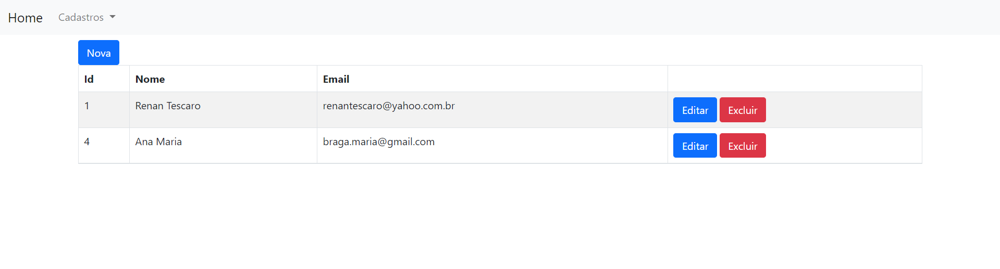

### Flask SQL Alchemy
* https://flask.palletsprojects.com/en/2.0.x/
* https://flask-sqlalchemy.palletsprojects.com/en/2.x/

 

 

### Instalar todas as dependências
* pip install -r requirements.txt

 

### Instalar dependências manualmente
* flask==1.1.2
* Flask-SQLAlchemy==2.5.1
* waitress==2.0.0
* mysqlclient==2.0.3
* python-dotenv==0.17.0

 

### Configurações
* arquivo .env

 

### Executar aplicação
* > python3.7 run.py

 